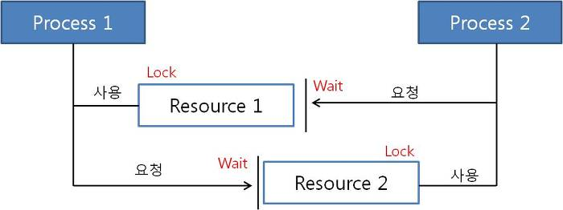

# Deadlock(데드락, 교착상태)

### Deadlock
- 두개 이상의 프로세스나 스레드가 서로 자원을 얻지 못해서 다음 처리를 하지 못하는 상태
- 무난히 다음 자원을 기다리게 되는 상태
- 한정된 자원을 여러곳에서 사용할 때 발생

#### 데드락이 일어나는 경우

프로세스1과 2가 자원1,2를 모두 얻어야 한다고 가정
- t1: 프로세스1이 자원1을 얻음/ 프로세스2가 자원2를 얻음
- t2: 프로세스1은 자원2를 기다림/ 프로세스2는 자원1을 기다림

서로 원하는 자원이 상대방에 할당되어 있어서 두 프로세스는 무한정 wait에 빠짐 => Deadlock

#### 데드락이 발생하는 경우
- 멀티 프로그래밍 환경에서 한정된 자원을 얻기위해 서로 경쟁할 때
- 한 프로세스가 자원을 요청했을 때, 동시에 그 자원을 사용할 수 없는 상황 발생 -> 대기 상태로 들어감
- 대기 상태로 들어간 프로세스들이 실행 상태로 변경될 수 없을 때 '교착상태' 발생

### 데드락 발생 조건
>**4가지 모두 성립해야 데드락 발생, 하나라도 만족하지 않으면 절대 발생하지 않는다**
1. 상호 배제(Multual exclusion)  
   : 자원을 한번에 한 프로세스만 사용할 수 있음
2. 점유 대기(Hold and Wait)   
   : 최소한 하나의 자원을 점유하고 있으면서 다른 프로세스에 할당되어 사용하고 있는 자원을 추가로 점유하기 위해 대기하는 프로세스 존재
3. 비선점(No Preemption)  
   : 다른 프로세스에 할당된 자원을 사용시 끝날때까지 강제로 빼앗을 수 없음
4. 순환대기(Circular wait)  
   : 프로세스의 집합에서 순환 형태로 자원을 대기하고 있어야 함  
   프로세스가 p0. p1, p2, ..., pn까지 있을때
   > p0은 p1이 가진 자원을 기다리고,  
   p1은 p2가 가진 자원을 기다리고,   
   Pn-1은 Pn이 가진 자원을 기다리고,  
   Pn은 p0이 가진 자원을 기다림

### Deadlock 처리 방법
>사전에 교착 상태가 발생하지 않도록 조치하거나 발생한 뒤에 고정
#### 교착상태 예방 및 회피
1. 예방(Prevention)
    - 자원을 할당할 때, 교착상태 조건 중 하나를 제거하면서 해결 => 자원 낭비 심함
    - 사전에 교착상태가 발생하지 않도록 조치
        - 상호배제 부정 : 여러 프로세스가 공유 자원 사용
          - 하나의 공유 자원에 대해 두개의 프로세스가 동시에 접근이 불가능한데 이를 제거해서 하나의 공유 자원에 대해 프로세스들이 동시에 접근하게 함
          - 이는 구현하기가 진짜 어렵고 구현하더라도 관리하기가 어렵기때문에 현실적으로 불가능함
        - 점유대기 부정 : 프로세스 실행 전 모든 자원 할당
          - 특정 프로세스가 작업을 수행할 때, 그 해당 자원의 필요한 리소스들을 먼저 요청을하고 전부 할당받은 후에 작업을 실행하여 점유대기 조건 제거 가능
          - 자원의 효율성이 매우 떨어짐
          - 프로세스들이 주기적으로 어떤 자원을 필요로 하는지 계속 파악하는데 추가적인 오버헤드 발생
        - 비선점 부정 : 자원 점유 중인 프로세스가 다른 자원을 요청할 때 가진 자원 반납
          - 프로세스가 다른 프로세스의 자원을 요청하기 위해서는 자신이 가지고 있는 자원을 반납해야함
          - 지금까지 프로세스가 작업한 것을 잃을 수 있음
        - 순환대기 부정 : 자원에 고유번호 할당 후 순서대로(오름차순 또는 내림차순) 자원 요구
2. 회피(Avoidance)
   - 교착 상태 발생 가능성을 검사해서 발생 가능성이 있다면 사전에 회피하는 방식
   - 리소스 할당 측면에서, 교착 상태가 발생할 가능성이 있는 자원일 경우에는 할당하지 않음 (대표적으로 은행원 알고리즘, 자원 할당 그래프가 있음)
   - 시스템 state가 원래 state로 돌아올 수 있는 경우에만 자원 할당(CPU, memory)
   - 프로세스가 자원 요청 시, 자원을 할당한 후에도 안정 상태로 남아있는지 사전 검사한 후에 안정상태라면 자원을 할당하고 불안정 상태라면 다른 프로세스가 자원을 해지할 때까지 대기
     - 자원을 요청할 때마다 시스템 상태를 검사하는 만큼 오버헤드가 큼
   - 자원 당 인스턴스 1개 : 자원 할당 그래프 알고리즘
   - 자원 당 인스턴스 여러개 : 은행원 알고리즘(전제 조건이 많음)
   > 일반적으로 자원 사용 효율성이 떨어지고 비용이 많이 드는 방법   
   > => 데드락을 막을 수 있지만, 데드락을 생각해서 제약조건을 많이 달면 비효율적임
   ##### 은행원 알고리즘
   - 은행에서 모든 고객의 요구가 충족되도록 현금을 할당하는데서 유래
   - 프로세스가 자원을 욕할 때, 시스템은 자원을 할당한 후에도 안정 상태로 남아있게 되는지 사전에 검사하여 교착 상태 회피
   - 안정 상태면 자원 할당, 아니면 다른 프로세스들이 자원 해지까지 대기
     

   시스템 자원이 A :10 B : 5, C : 7 라면

   Need(Max-Allocation) 값은

   | |A|B|C|
   |:---:|:---:|:---:|:---:|
   |P0|7|4|3|
   |P1|1|2|2|
   |P2|6|0|0|
   |P3|0|1|1|
   |P4|4|3|1|

   Need 값이 Avaliable 값보다 작거나 같아야지 자원할당이 가능
    1. P0 => 할당 안됨
    2. P1 => (1,2,2) <= (3,3,2) 할당 됨 => 자원 반환 => Available (5,3,2)
    3. P2 => 할당 안됨
    4. P3 => (0,1,1) <= (5,3,2) 할당 됨 => 자원 반환 => Available (6,4,3)
    5. P4 => (4,3,1) <= (6,4,3) 할당 됨 => 자원 반환 => Available (6,4,5)
    6. P2 => (6,0,0) <= (6,4,5) 할당 됨 => 자원 반환 => Available (10,4,7)
    7. P0 => (7,4,3) <= (10,4,7) 할당 됨 => 자원 반환 => Available (10,5,7)
   
      =>P1 -> P3 -> P4 -> P2 -> P0 일때 안전

### 교착 상태를 탐지 및 회복
> 교착 상태를 허용하지만 상태를 탐지하고 회복하는 방식
> 교착 상태를 일으킨 프로세스를 종료하거나, 할당된 자원을 해지함으로써 회복
> 알고리즘을 주기적으로 실행함으로써 시스템에 발생한 Deadlock을 체크하고 회복
1. 탐지(Detection)
    - 자원 할당 그래프를 통해 교착 상태 탐지
    - 자원 요청시, 탐지 알고리즘 실행시켜 그에대한 오버헤드 발생
   
2. 회복(Recovery)
    - 교착 상태 일으킨 프로세스를 종료하거나, 할당된 자원을 해결시켜 회복시키는 바법

   #####자원 할당 그래프 알고리즘

      

      (a) 자원 할당 그래프 (b) 대기 그래프   
   
      그래프 상에 교착 상태를 유발시키는 **순환 사이클** 존재 유무를  체크
      데드락 탐지 방법도 알고리즘을 실행해야하는데 주기를 너무 짧게해서 실행하게 되면 회피와 똑같이 오버헤드가 커지기 때문에  시스템의 특성이나 비용적인 측면들을 고려해서 어느주기로 알고리즘을 실행할지 결정해야함 
      
#### 프로세스 종료 방법
- 교착 상태의 프로세스를 모두 중지
  - 가장 간단하지만 프로세스들이 지금까지 작업해 온것들을 유실할 수 있음
- 교착 상태가 제거될 때까지 하나씩 프로세스 중지
  - 하나의 프로세스를 죽이고 알고리즘을 돌려서 교착상태가 해결됐는지 주기적으로 확인해야하기 때문에 오버헤드가 큼

#### 회복 고려 사항
1. 희생자 선택
   - 데드락에서 회복할때 어떤 프로세스를 죽일것인지 또는 어떤 프로세스의 자원을 선정을 해서 다른 프로세스에게 할당을 할것인지 선택
   - 비용측면에서 많이 접근하는데 프로세스가 어느정도 구동을 했는지 자원을 가지고 있는지 등을 통해서 희생자를 선택함
   - 너무 비용적이 측면에서 선택하면 기아 상태가 발생하기 쉬움
   - 매번 걸리는 프로세스만 희생자로 선택될 수 있음
   - 희생자를 선택할 때 비용측면 뿐만아니라 다양한 파라미터 가중치 등을 고려해서 선택해야 함 
   - 희생자를 선택했다면 어느정도 수준에서 후퇴(프로세스를 죽였다 다시 킬 것인지 or 교착 상태가 어느정도 해결될 정도만 rollback) 할 것인지 등도 고려해야함 
2. 후퇴(Rollback)
3. 기아 상태(Starvation)

#### Deadlock 무시
> 교착 상태 자체를 무시하고, 특별한 조치를 취하지 않는 방법
> 교착 상태의 발생 확률이 낮은 상황에서 주로 사용
> 유닉스나 윈도우에서 많이 사용함

#### 자원 선점 방법
- 교착 상태의 프로세스가 점유하고 있는 자원을 선점해 다른 프로세스에게 할당(해당 프로세스 일시정지 시킴)
- 우선 순위가 낮은 프로세스나 수행 횟수가 적은 프로세스 위주로 프로세스 자원 선점
  > Deadlock 발생은 허용하고 그에 대한 detection 루틴을 두어 deadlock 발견시 recover

